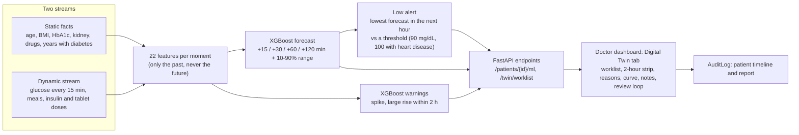

# SmartPoli Digital Twin

A digital twin for **type 2 diabetes**, built for the Happiest Health *Digital Twin Challenge 2026* inside the SmartPoli app.
For a patient with a continuous glucose sensor, it forecasts sugar for the next 2 hours with a likely range, warns about lows and highs, explains why in plain
words, and gives the doctor a short list of next steps. It is a risk flag for the doctor. It never diagnoses and never changes a treatment.

> **Submission details (the team fills these in before 20 Oct 2026, 7:00 PM IST):**
> Live demo: [https://smartpoli-kxzt.onrender.com](https://smartpoli-kxzt.onrender.com) | Team name: **Nexons** | College: **GL Bajaj Institute of Technology and Management** | Members: **Garv Chopra, Shashwat Shukla, Vishesh Agrahari** | Demo video (at least 20 minutes): `TODO link` |
> Architecture diagram (PDF/PPT): `TODO` | Presentation (PDF/PPT): `TODO` | Submission folder name: `Nexons_GL Bajaj Institute of Technology and Management`

## 1. The problem and the use case

People with type 2 diabetes on insulin or tablets can swing too low (risky, especially with heart disease) or too high without warning. Doctors see snapshots, not the
next few hours. The challenge asks for a *virtual patient*: a model that fuses static health records with a live wearable stream and predicts an adverse event before it happens.

Our twin does that for glucose:
- **Static stream:** age, sex, body size, years with diabetes, HbA1c, kidney function, whether the patient has high blood pressure, and which diabetes drugs the patient takes.
- **Dynamic stream:** continuous glucose readings every 15 minutes plus logged meals and insulin or tablet doses.
- **Output for the doctor:** a 2-hour sugar forecast with an 80% range, the chance of a spike or a large rise, a Calm / Watch / Alert level for lows, the top reasons,
  an amber heart note when a low alert fires for a patient with heart disease, and actions (write a note, mark as reviewed, snooze) that are recorded on the patient timeline.

## 2. How it works



**Features (22).** Current sugar, change over 30 and 60 minutes, lowest, highest and spread over the last hour, hour of day (two numbers), minutes since the last meal, insulin dose and
diabetes tablet, the size of the last insulin dose, and ten patient facts. They are computed by `ml/features.py` for training and by the plain-Python `backend/twin_features.py` in the app;
`backend/tests/test_twin_features.py` checks the two give the same numbers.

**Labels.** A low is two or more readings in a row under 70 mg/dL, a spike two or more over 180, a large rise reaches the patient's own 90th percentile of the last day and at least 30 above their median.
Labels use sensor values corrected for each recording's offset against finger-prick checks; the model's inputs stay the raw sensor values. The first 12 hours of a recording get no low label.

**Honest testing.** Patients, not rows, are split: 79 development patients (5 patient-wise folds, used for every choice) and 21 locked test patients (20 random plus demo patient A) scored **once**
(`ml/final_test.py` refuses to run a second time). The number of trees was chosen by cross-validation on the development patients only.

**Models compared** (same folds): a simple rule, logistic regression, random forest, extra trees, LightGBM, XGBoost and a small neural network (`ml/compare_models.py`, `ml/model_comparison.csv`).
Tree models won for spikes and rises and were about tied with each other, so we ship **XGBoost**. For lows the plain sugar rule and the forecast were the strongest alerters; the shipped low alert is
driven by the forecast (`ml/lows_alert_check.py`, `ml/lows_forecast_alert.py`).

## 3. Code map: where the machine learning lives

The whole model is plain Python (about 1,000 lines) plus 16 small saved XGBoost files. In the order it was built:

| Step | File | What it does |
|---|---|---|
| 1. Data | [`ml/scripts/prepare_shanghai_t2dm.py`](ml/scripts/prepare_shanghai_t2dm.py) | turns the ShanghaiT2DM files into clean tables |
| 2. Labels | [`ml/labels.py`](ml/labels.py) | what we predict: low, spike, large rise, with the sensor-offset correction |
| 3. Features | [`ml/features.py`](ml/features.py) | the 22 inputs per moment, with a no-future-leak test |
| 4. Honest split | [`ml/split.py`](ml/split.py), `ml/splits.csv` | 79 development patients, 21 locked test patients |
| 5. Baselines and model choice | [`ml/baseline.py`](ml/baseline.py), [`ml/compare_models.py`](ml/compare_models.py), `ml/model_comparison.csv` | simple rule and logistic regression against random forest, LightGBM, XGBoost and a neural net |
| 6. Forecast | [`ml/forecast.py`](ml/forecast.py) | XGBoost forecast at +15 / +30 / +60 / +120 min with a 10-90% range |
| 7. Final test, once | [`ml/final_test.py`](ml/final_test.py), `ml/final_test_results.txt` | scores the locked patients one time and refuses to run again |
| 8. Re-check live | [`ml/verify_models.py`](ml/verify_models.py), `ml/verify_models_output.txt` | reloads the saved models, prints them next to the baselines on the locked patients, then runs hand-written synthetic patients through the app code (behaviour checks, not accuracy) |
| 9. Experiments, including what failed | [`ml/EXPERIMENT_LOG.md`](ml/EXPERIMENT_LOG.md) | the low-alert experiments, with the reason each was or was not adopted |

How the saved models run inside the app: [`backend/twin_service.py`](backend/twin_service.py) loads them from [`backend/twin_models/`](backend/twin_models/) and writes the doctor-screen text; [`backend/twin_features.py`](backend/twin_features.py) rebuilds
the 22 features (a test checks it matches training exactly); [`backend/ml_router.py`](backend/ml_router.py) holds the endpoints; [`backend/static/twin.js`](backend/static/twin.js) draws the Digital Twin tab.

## 4. Results on the 21 locked test patients

| What | Result |
|---|---|
| Spike within 2 h | AUC 0.817, precision-recall AUC 0.482 (base rate 0.184). At a cut-off chosen on development patients: precision 43%, recall 64%, F1 0.51 |
| Large rise within 2 h | AUC 0.840, precision-recall AUC 0.484 (base rate 0.154). Precision 39%, recall 68%, F1 0.50 |
| Probability reliability | calibration error about 2 percentage points for both |
| Forecast typical error (mg/dL) at +15 / +30 / +60 / +120 min | 5.2 / 10.2 / 17.4 / 26.7, against 6.7 / 12.3 / 21.1 / 33.0 for "sugar stays where it is" |
| Forecast range | the 10-90% band contained 80 / 80 / 79 / 77% of real values (target 80%) |
| Low alert (25 low events in 6 patients, 248 patient-days) | warned 24 of 25 events (96%) at 1.5 alerts per patient per day; the plain sugar rule warned 22 of 25 |

Full output: `ml/final_test_results.txt` and `ml/extra_metrics_results.txt`.

## 5. Limits you should know about

- **Most low alerts are precautionary.** About 1 alert in 14 is followed by a real low within the hour (precision 7%), while 96% of real lows were warned about. We label it Calm / Watch / Alert, never "a low is coming".
- **Small low-event sample:** 25 events from 6 patients (13 of them from the demo patient). Treat the low-alert result as a strong hint, not proof.
- **One population.** The models learned from 100 patients in the ShanghaiT2DM dataset (Shanghai, China); they may be less accurate for patients elsewhere. The second demo patient comes from a different dataset and sensor and is shown with a lower-confidence banner.
- **60-minute forecast error (17.4 mg/dL)** is not better than a published figure of 14.9 that we have not verified; we make no like-for-like claim.
- **Adherence is untested:** missed doses feed the model through "time since the last dose", but how well it reacts to them has not been measured.
- A sensor that reads too low or too high can cause false alarms. The twin works from the sensor reading only.

## 6. Data and credits

- **ShanghaiT2DM** (Zhao Q. et al., *Chinese diabetes datasets for data-driven machine learning*, Scientific Data 2023, [paper](https://www.ncbi.nlm.nih.gov/pmc/articles/PMC9849330/)), **CC BY 4.0**. 100 patients, 109 recordings, 15-minute glucose, meals, medicines and background facts.
  All model training and testing use only this dataset. One anonymised recording is included as **demo patient A** (`backend/twin_demo_data/demo_a.json`). It is real research data, not a made-up patient, and is credited in the app.
- **CGMacros** ([PhysioNet](https://physionet.org/content/cgmacros/1.0.0/)): used only for the second demo patient and the heart-rate line, never for training or scoring. Its licence is share-alike and non-commercial, so it is **not** included in this repository.
- No real SmartPoli user data is used anywhere in the twin, its training or the demo.

## 7. Try it

**Live demo:** [https://smartpoli-kxzt.onrender.com](https://smartpoli-kxzt.onrender.com). Open it, tap **Open the doctor demo**, then **Digital Twin** in the menu. A short on-screen tour starts by itself the first time; after that you drive it.

Run it locally (optional):

```bash
cd backend
pip install -r requirements.txt
SMARTPOLI_TWIN_ENABLED=1 SMARTPOLI_DEMO_LOGIN=1 SMARTPOLI_DEMO_SEED=1 \
SMARTPOLI_DATABASE_URL=sqlite:///./demo_local.db SMARTPOLI_DISABLE_SCHEDULER=1 \
SMARTPOLI_JWT_SECRET=local-secret uvicorn main:app --port 8010
```

Open `http://localhost:8010/login`, tap **Open the doctor demo** (doctor `doctor@smartpoli.demo`, password `demo1234`), then **Digital Twin** in the menu.
Move the replay slider on demo patient A to 10 Nov 2020: at 09:52 the twin shows *Watch*, and at 10:07 *Possible low in about 30 minutes*, about 30 minutes before the real low at 10:37.

Deploy the demo on Render step by step: [`docs/RENDER_DEMO_DEPLOY.md`](docs/RENDER_DEMO_DEPLOY.md). Settings and data notes: [`docs/DEMO_COPY.md`](docs/DEMO_COPY.md).

**Tests** (from `backend/`): `python -m pytest tests -q`. One upstream test, `test_timing_api.py::test_dashboard_lists_only_todays_doses_and_the_next_day_starts_fresh`, hard-codes a date and fails on other days; it is not part of the twin.

**Reproduce the machine learning** (needs the cleaned ShanghaiT2DM files in `ml/data/shanghai_t2dm_clean/`; see `ml/scripts/prepare_shanghai_t2dm.py`):

```bash
cd ml
pip install -r requirements.txt
python labels.py data/shanghai_t2dm_clean/shanghai_t2dm_timeseries.csv   # must print OK for all three labels
python features.py data/shanghai_t2dm_clean                              # includes a no-future-leak test
python split.py data/shanghai_t2dm_clean/shanghai_t2dm_timeseries.csv
python compare_models.py data/shanghai_t2dm_clean
python forecast.py data/shanghai_t2dm_clean
# python final_test.py data/shanghai_t2dm_clean   # the locked-test run: results are already saved, it refuses to run twice
```

## 8. Repository map

| Path | What it holds |
|---|---|
| `backend/` | the SmartPoli app (FastAPI + plain JavaScript); the twin is `ml_router.py`, `twin_service.py`, `twin_features.py`, `twin_demo_seed.py`, `twin_models/`, `static/twin.js` |
| `ml/` | labels, features, patient-wise split, model comparison, forecast, final locked test, results files, practice notebooks, design prototypes |
| `docs/` | deploy and design notes (`RENDER_DEMO_DEPLOY.md`, `DEMO_COPY.md`) and the existing app documents |
| `android/` | the existing Android wrapper of the app |

## 9. Licence

The code in this repository is released under the **MIT License** (see [`LICENSE`](LICENSE)). The ShanghaiT2DM data and anything derived from it, including the demo patient and the trained models, stay under
**CC BY 4.0**: keep the credit above when you reuse them. Python packages keep their own licences. This software is not a medical device and is not for medical decisions.
